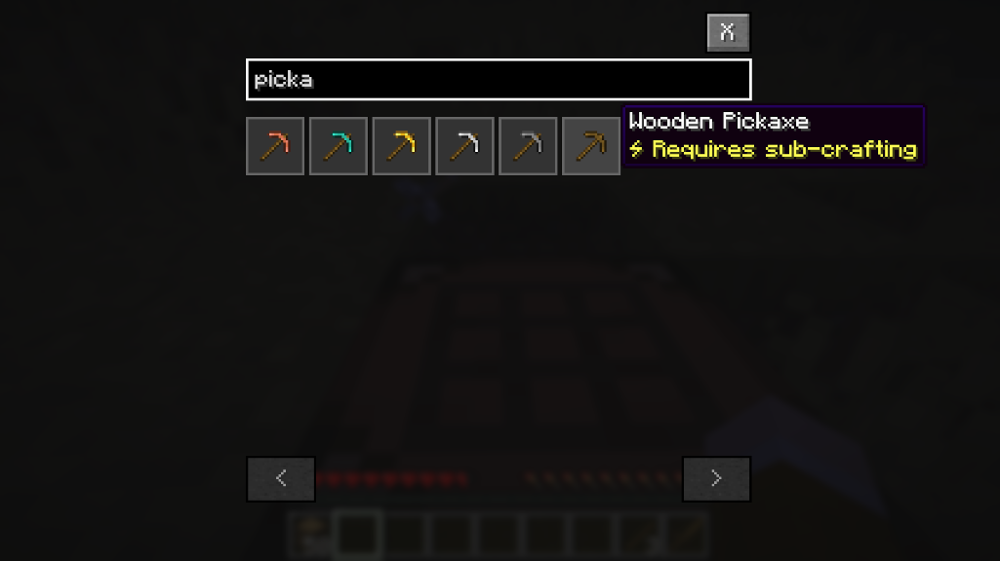

# Smart Recipe Book

A Fabric mod that enhances Minecraft's recipe book with intelligent auto-crafting of sub-components.



## Features

- **Smart Filtering** - Shows only recipes you can actually craft with your current inventory
- **Auto-Craft Sub-Components** - Automatically crafts intermediate items needed for complex recipes
- **Recipe Tree Analysis** - Calculates full crafting chains up to 3 levels deep
- **Multi-Step Crafting Plans** - Executes complex crafting sequences automatically
- **Inventory-Aware** - Tracks available materials across your inventory in real-time

## Requirements

- Minecraft 1.21.11
- Fabric Loader 0.18.1+
- Fabric API
- Java 21+

## Installation

1. Install [Fabric Loader](https://fabricmc.net/use/installer/)
2. Download [Fabric API](https://modrinth.com/mod/fabric-api)
3. Download the latest Smart Recipe Book JAR from [Releases](https://github.com/fatlard1993/smart-recipe-book/releases)
4. Place both JAR files in your `mods` folder

## Usage

Open your inventory or crafting table - the recipe book now shows only craftable recipes. Click a recipe with missing sub-components and the mod will automatically craft them first.

## Building from Source

```bash
./gradlew build
```

The JAR will be in `build/libs/`.

## License

MIT - See [LICENSE](LICENSE) for details.
